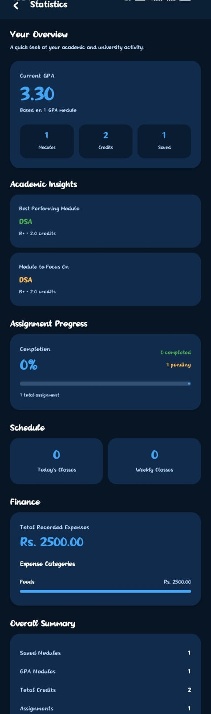

# 📱 UNIMATE LK

A university companion Android application designed to help students
manage their academic and financial activities.

## ✨ Features

- 🎓 GPA Calculator
- 💰 Expense Tracker
- 💵 Income Tracking
- ⚖️ Balance Tracking
- 📅 Date-based Transactions
- 🗑️ Edit & Delete Transactions
- 📊 Category Summary
- 🎯 Monthly Budget

## 📸 Screenshots

  
  
  
  
  

## 🛠️ Technologies

- Kotlin
- Jetpack Compose
- Android Studio
- Material Design
